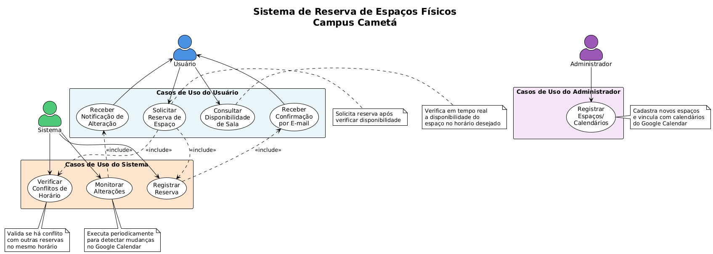
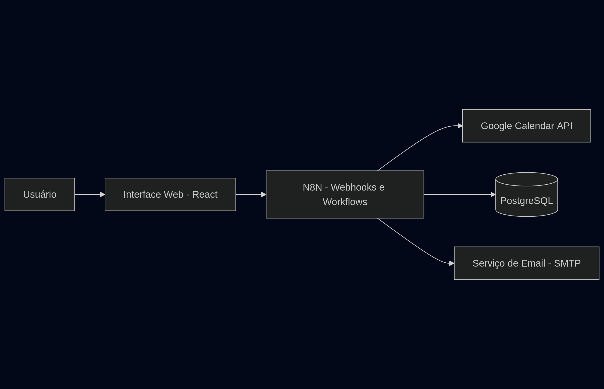
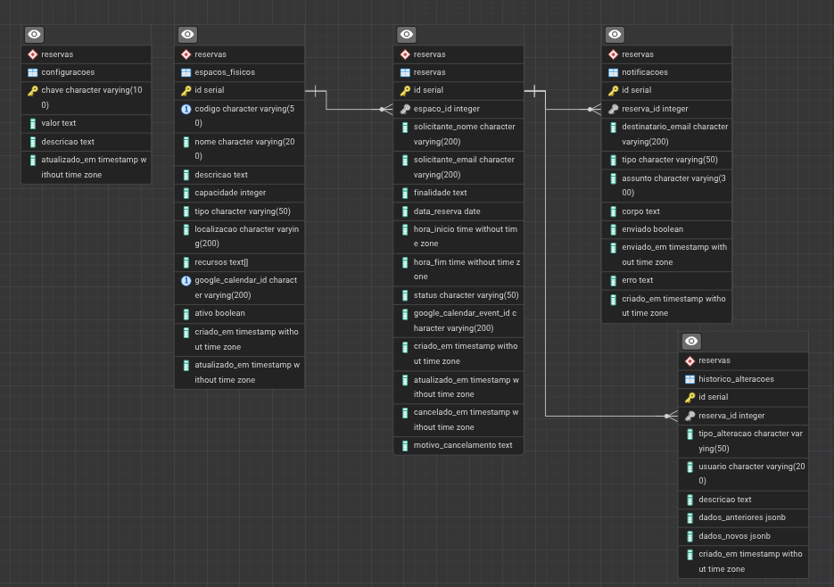

# 📅 Chatbot de Reserva de Espaços Físicos – Campus Cametá

# 1. Visão Geral

Este projeto consiste em um **chatbot para reserva de espaços físicos** do Campus Cametá, integrando **Google Calendar**, **n8n**, **PostgreSQL** e uma **interface web em React**. O sistema permite que usuários consultem a disponibilidade de salas, realizem reservas e recebam notificações automáticas por e-mail.

O projeto foi desenvolvido como **MVP do Projeto Integrador I**, com foco em automação, integração de serviços e aplicação de conceitos de Engenharia de Software.


# 2. Objetivos

* Automatizar o processo de reserva de salas do campus
* Evitar conflitos de horários
* Centralizar a gestão de espaços físicos
* Reduzir trabalho manual da coordenação
* Demonstrar integração entre sistemas via APIs e workflows

---

# 3. Escopo do MVP

* Consulta de disponibilidade de salas
* Criação de reservas
* Registro no Google Calendar ou simulação via PostgreSQL
* Envio de e-mail de confirmação
* Monitoramento básico de alterações em reservas

---

# 4. Tecnologias Utilizadas

* **Frontend:** React, CSS
* **Automação / Backend:** n8n
* **Banco de Dados:** PostgreSQL
* **Integrações:** Google Calendar API, SMTP
* **Comunicação:** Webhook (possível integração com WhatsApp ou Telegram)

---

# 5. Requisitos
## 5.1 Requisitos Funcionais (RF)

* **RF01** – Permitir que o usuário consulte a disponibilidade de um espaço físico informando data e horário
* **RF02** – Permitir que o usuário solicite a reserva de um espaço disponível
* **RF03** – Registrar a reserva no Google Calendar ou no banco PostgreSQL
* **RF04** – Enviar e-mail de confirmação ao solicitante após a reserva
* **RF05** – Detectar conflitos de horário antes de confirmar a reserva
* **RF06** – Monitorar alterações ou exclusões de reservas
* **RF07** – Notificar o solicitante quando uma reserva for alterada ou cancelada

---

## 5.2 Requisitos Não Funcionais (RNF)

* **RNF01** – O sistema deve responder às consultas em até 3 segundos
* **RNF02** – Garantir integridade dos dados no banco de dados
* **RNF03** – Utilizar autenticação segura para acesso ao Google Calendar (OAuth2)
* **RNF04** – Ser compatível com navegadores modernos e dispositivos móveis
* **RNF05** – Manter credenciais sensíveis em variáveis de ambiente
* **RNF06** – Permitir fácil manutenção e extensão dos workflows

---

# 6. Atores do Sistema

* **Usuário/Solicitante:** realiza consultas e solicita reservas
* **Sistema (Chatbot):** processa solicitações e responde ao usuário
* **Administrador:** mantém salas e calendários

---

## 6.1 Diagrama de Casos de Uso

**Ator:** Usuário

* Consultar disponibilidade de sala
* Solicitar reserva de espaço
* Receber confirmação por e-mail
* Receber notificação de alteração

**Ator:** Sistema

* Verificar conflitos de horário
* Registrar reserva
* Monitorar alterações

**Ator:** Administrador
* Registrar espaços/calendários




---

# 7. Diagrama de Arquitetura do Projeto



**Descrição:** O usuário interage com a interface web ou chatbot. As requisições são enviadas ao n8n via Webhook, que orquestra a lógica de negócio, consulta o banco de dados ou o Google Calendar, registra reservas e dispara notificações por e-mail.

---

# 8. Diagrama Entidade-Relacionamento




# 9. Configuração do Projeto

Esta seção descreve as configurações necessárias para que o sistema funcione corretamente em ambiente local, conforme o escopo do MVP.


### 9.1 Configuração do Google Calendar

* Criar um projeto no **Google Cloud Console**
* Ativar a **Google Calendar API**
* Criar credenciais OAuth2 (tipo Web Application)
* Configurar a URL de callback do N8N
* Criar um calendário para cada espaço físico
* Registrar os **Calendar IDs** no banco de dados PostgreSQL

---

### 9.2 Configuração do N8N e Instalação do PostgreSQL

* Instalar o N8N e PostgreSQL via docker
```bash
cd docker
docker compose up -d
```
* Criar conta administrativa no primeiro acesso
* Configurar credenciais:

  * Google Calendar OAuth2
  * PostgreSQL
  * SMTP (Email)
* Importar os workflows JSON do diretório `campus-reserva/n8n-workflows/`
* Ativar os workflows
* Copiar as URLs dos Webhooks para uso no frontend

---

### 9.3 Configuração do PostgreSQL

* Criar banco de dados `campus_reservas`
* Criar usuário dedicado para o N8N
* Executar o script `campus-reserva/database-schema.sql`
* Atualizar os Calendar IDs com `campus-reserva/update-calendar-ids.sql`
* Garantir integridade com chaves, constraints e índices

---

### 9.4 Configuração do Frontend (React)

* Instalar dependências com:
```bash
cd campus-reserva
npm install
```
* Configurar as URLs dos Webhooks do N8N no arquivo `App.js`
* Atualizar a lista de espaços físicos conforme o banco de dados
* Iniciar aplicação com:

```bash
npm start
```

---

## 10. Estrutura do Projeto

```
├── campus-reservas/
    ├── README.md
    ├── database
    ├── ├── database-schema.sql
    ├── ├── update-calendar-ids.sql
    ├── n8n-workflows/
    │   ├── check-availability.json
    │   ├── create-reservation.json
    │   └── monitor-changes.json
    ├── src/
    │   ├── App.js
    │   ├── App.css
    │   └── index.js
    └── public/
        └── index.html
├── docker
    ├── docker-compose.yml
```

---

## 11. Fluxo de Funcionamento

1. Usuário informa sala, data e horário
2. n8n verifica disponibilidade
3. Caso disponível, registra a reserva
4. Envia e-mail de confirmação
5. Workflow de monitoramento verifica alterações periodicamente

---

## 12. Segurança

* OAuth2 para Google Calendar
* Validação de dados no frontend e no workflow
* Constraints e chaves no banco de dados

---

## 13. Conhecimentos Aplicados

* Engenharia de Software (casos de uso, requisitos, arquitetura)
* Integração de APIs
* Automação de processos
* Banco de dados relacional
* Lógica de verificação de conflitos de horário

---


**Projeto Integrador I – Curso de Sistemas de Informação**
